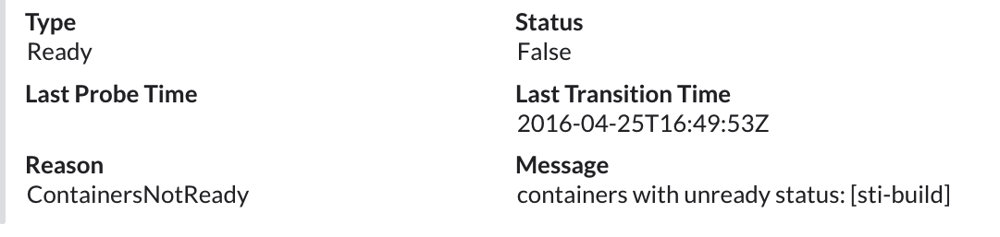

# Slack Fieldify 
http://brett.neese.rocks

A simple Node module that flattens a JavaScript object into a set of "fields" compatible with Slack's API; making it easier to make Slack notifications from aribtary JSON data.  

Automagically turning this:

```
{ type: 'Ready',
  status: 'False',
  lastProbeTime: null,
  lastTransitionTime: '2016-04-25T16:49:53Z',
  reason: 'containers with unready status' }
```

Into this:




See the [Slack docs](https://api.slack.com/docs/attachments#fields) for more info on fields. They're pretty neat.
 
## Features: 

- Long and short "fields"
- Custom prefixes for multidimensional arrays

## Usage 
slackFieldify(object, [short], [prefix])

- @param  {Object} inputObj 
- @param  {boolean} [False] short? - Whether you want the fields to be long, for verbose data or short, for short data  
- @param  {string} [] prefix? - Prepends things to the output. Mostly used inside the function. 
- @returns {Object} fields - a Slack-ready set of "fields" 

## Example
slackFieldify = require('slack-fieldify')

/// In your Slack webhook....

attachments {     
    fields: slackFieldify(JSON.parse(jsonDataFromAPI), true);
}

## N.b 

Also works for arrays, or arrays of objects. If there's multiple objects in an array,
it'll prepend the output with their index. 

If there's only one object in an array, it won't. 
